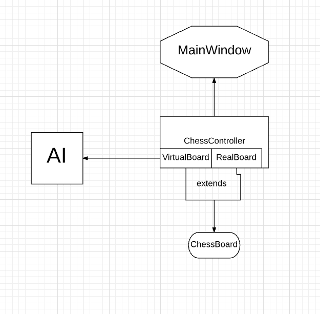
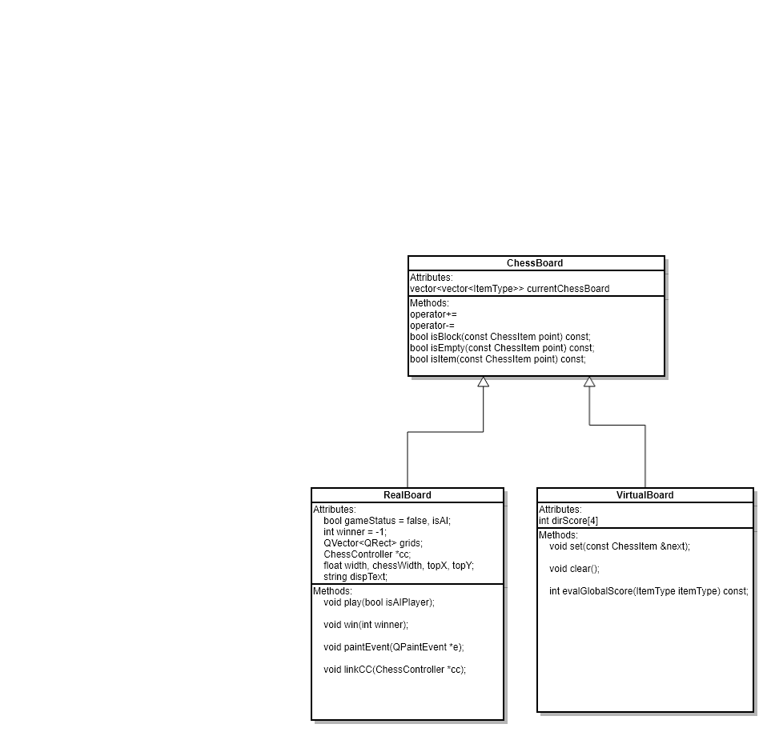
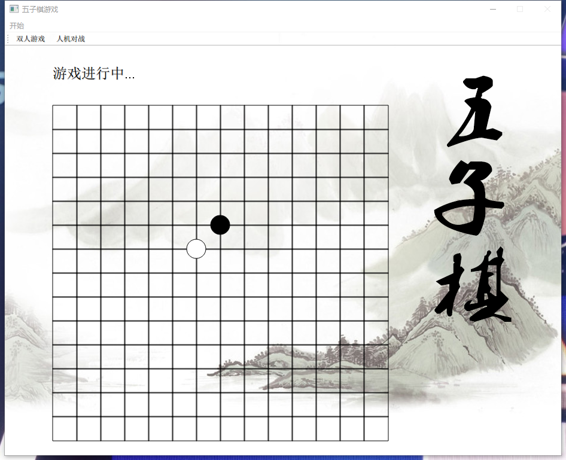
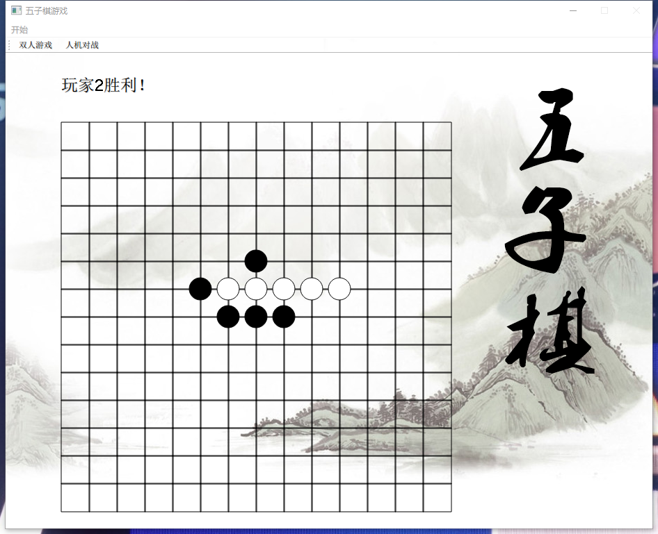
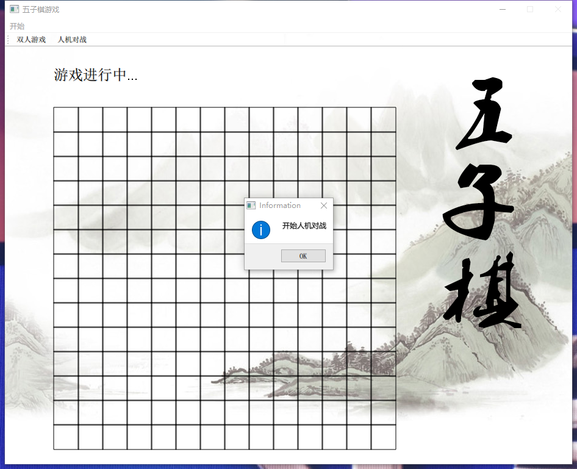
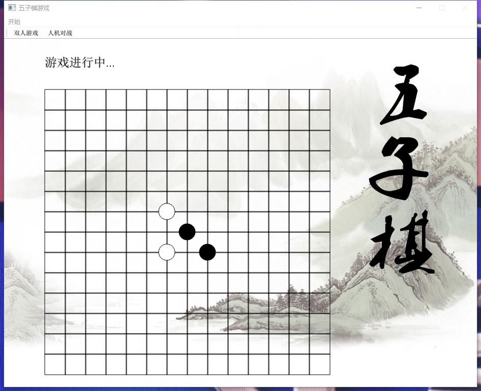
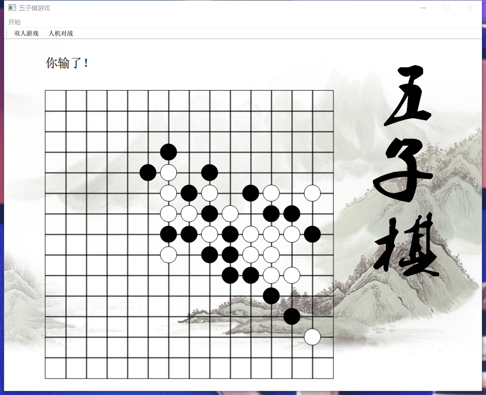

# 五子棋游戏设计报告

## 组员：
* 柳昊天 3150105318
* 任意 3150103692
* 赖杰文 3150105192
* 吴越 3150101992

## 一、总概述

- 总功能： 通过图形界面，用户可以通过本游戏程序进行五子棋游戏的双人游戏或者人机对战，游戏程序可以正确判断出游戏的胜负
- 开发工具为 C++ （语言标准为C++11）语言，使用了QT库以实现图形和跨平台
- 总体的设计思路如下：
    总体的架构采用了 MVC（Model-View—Controller）模式，Model 为 ChessBoard 类，View 为 MainWindow 类，Controller 为 ChessController 类。 
- 命名规则统一使用驼峰命名法，缩进为 4 空格，中文部分编码为 UTF-8 

## 二、模块功能

- MainWindow

    - `MainWindow` 类是 View 中负责用户交互的部分。
    - 设置游戏模式
    - 监听点击事件，并将事件转换为棋盘中的逻辑位置
    - 和 ChessController 交互
    - 提供菜单和开始游戏的选项
- ChessBoard
    - 记录当前棋盘的状态
    - 可以增添或者删除棋子
    - 判断一个即将添加进棋盘的棋子是否越界或者重复
    - 对于`VirtualBoard` 子类，还需提供整个棋盘的估值函数，保存AI预测的下法
    - 对于`RealBoard` 子类，还需绘制整个棋盘内的每个棋子

- ChessController
    - 绑定 RealBoard 和 VirtualBoard 实例
    - 管理游戏的状态，开始和结束游戏等
    - 判断游戏的输赢
    - 接受转换过的点击时间，添加棋子进棋盘内
    - 提供AI的下一步走法

- AI
    - 根据当前棋盘的形势给出下一步的最优解


## 三、类之间的关系和模块间接口
-   `MainWindows`

    ```C++
    public:
    void chessInstance(ChessController *cc);
    ```
    这个接口用于绑定 ChessConroller 实例

-   `ChessController`

    ```C++
    ChessController(RealBoard &cb) : cb(cb), curChessBoard(cb.getChessBoard()),virtualBoard(WHITE) {
    }
    ```
    这是 ChessContrller 的构造器，通过绑定一个 RealBoard 实例来控制棋子的显示，并且默认将 virtualBoard 实例用 WHITE 初始化（也就是说AI是白子后手）。

    ```C++
    void startGame(bool isAIPlayer);
    ```
    这个接口初始化游戏化的状态，重置virtualBoard，使程序进入游戏状态。参数决定游戏是以人机模式还是双人对战模式运行

    ```C++
    ChessItem AIgo();
    ```
    在AI模式下，这个方法会提供AI算出来的下一步

-   ```AI```

    ```C++
    ChessItem AI::getBestItem(const VirtualBoard &board)
    ```
    这个接口可以返回AI算出的最优解

    ```C++
    int negaMax(const VirtualBoard &thisBoard, int deep, int alpha, int beta, ItemType itemType, vector<ChessItem> &thisBestItems,vector<ChessItem>& steps);
    ```
    AI算法的核心部分，通过negaMax算法算出一方的分数

-   ```ChessBoard```

    ```C++
    ChessBoard();
    ```
    默认构造器，生成一个空棋盘

    ```C++
    ChessBoard(const ChessBoard &board);
    ```
    复制构造器

    ```C++
    ChessBoard &operator+=(const ChessItem &next);
    ```
    重载+=操作符，用于在棋盘上添加一个棋子

    ```C++
    ChessBoard &operator-=(const ChessItem &next);
    ```

    重载-=操作符，用于在棋盘上移除一个棋子


    ​```C++
    bool isBlock(const ChessItem point) const;
    ​```
    
    用于判断棋子是否越出棋盘的界或者出现在已被占用的地方
    
    ​```C++
    bool isEmpty(const ChessItem point) const;
    ​```
    判断棋盘的这个位置是否是空的
    
    ​```C++
    bool isItem(const ChessItem point) const;
    ​```
    判断棋盘的这个位置是否有棋子
    
    ​```C++
    virtual void clear();
    ​```
    虚函数，清空整个棋盘
    
    以下为protected：

    ​```C++
    void updateChess(int x, int y, ItemType val);
    ​```
    在棋盘的对应位置放置棋子（不做任何检查）
    
    ​```C++
    virtual void set(const ChessItem &next);
    ​```
    +=操作符的具体实现（检查棋盘的位置是否为空）
    
    ​```C++
    void remove(const ChessItem &next);
    ​```
    -=操作符的具体实现（不做任何检查）

-   ```VirtualBoard: ChessBoard```

    ```C++
    void VirtualBoard::clear()
    ```
    继承自ChessBoard的虚方法，不仅调用父方法，还清空了AI分数的估值数据

    ```C++
    void set(const ChessItem &next);
    ```
    继承自ChessBoard的虚方法，调用父方法并设置分数信息以供估值函数使用

    ```C++
    int evalGlobalScore(ItemType itemType) const;
    ```
    估值函数，估算这个棋子下之后双方的得分（形势）的值

    以下为private
    ```C++
    int evalScoreInOneDir(ChessItem item, int updateDir);
    ```
    在一个方向（上下左右对角线）上进行估值

    ```C++
    int calcTypeScore(int totalItems, int firstEmpty, int blockType,bool isEmpty);
    ```
    按照棋子的连续情况进行分类估值，例如是0000是连续四个白棋，估值为 FOUR（1000000），若00E0（E代表空），则估值为 THREE （1000）

-   ```RealBoard : public QWidget, public ChessBoard```
    因为这是个控制棋盘显示的控件，所以还继承自QWidget

    ```C++
    void play(bool isAIPlayer);
    ```
    开始游戏状态

    ```C++
    void win(int winner);
    ```
    供 ```ChessController``` 调用，结束游戏

    ```C++
    void paintEvent(QPaintEvent *e);
    ```
    在画布上绘制棋子

-   数据结构
    1. `ItemType`

        枚举类型，用于表示棋盘上每个位置的状态是黑子还是白子或者是空。

    2. `TypeScore`

        枚举类型，用于定义每种棋型对应的分数。

    3. `vector<vector<T>>`

        类似于一个二维数组，用于存储 15 * 15 棋盘中的信息，例如棋子还有各个位置的估值分数。


## 四、设计思路
- UI
    * 棋盘数据使用了 `vector<vector<ItemType>>` 进行存储，而在 `VirtualBoard` 内
    * 棋盘实际上是一个贴图，路径在 `/resources/chessBoard.png` 下。
      同时，MainWindow还会监听鼠标的点击释放事件，并且经过换算后转换为棋盘上的具体位置。但是棋盘中的棋子并不在 MainWindow 中绘制。
- 分模块
    * `ChessBoard` 是 Model 中负责记录当前棋盘数据的类。在内部使用了 `vector<vector<ItemType>>` （类似于一个二维数组）来表示棋盘里的黑白棋子和空位。
      `ChessBoard` 有两个子类，分别为 `RealBoard` 和 `VirtualBorad`, `RealBoard` 是 `ChessController` 中持有的实际棋盘，负责绘制棋盘中的棋子以及显示当前的游戏状态。`VirtualBoard` 则是提供给AI模块用来预先演算 5 - 6 步的棋盘以及供AI估算当前局面的双方分数。
    * `ChessController` 扮演了 Controller 角色, 它持有了两个棋盘的私有成员变量： `RealBoard` 和 `VirtualBoard`。`ChessController` 负责控制游戏的状态，包括判断游戏是否到达终止条件（即有一方获得胜利）以及确定当前下的棋子的颜色等。
    * `AI` 模块是本游戏中最复杂的模块，算法上使用了 `negaMax` 和 估值函数（位于 `VirtualBoard` 中） 以及 `alpha-beta` 剪枝 。
      `negaMax` 是一种 `minMax` 算法在零和游戏中的变种。由于零和游戏的性质，对一方有利的一步会对另一方不利。`negaMax` 相对 `minMax` 的改进在于，剪枝和搜寻对于玩家和AI双方都是可用的，所以一个函数可以既用来预测玩家的下一步，也可以运算AI的下一步。估值函数由于和当前棋盘的局面有关，所以定义为 `VirtualBoard` 的成员函数。`alpha-beta` 剪枝可以通过剪去比已经搜索过的节点更坏的节点来减少DFS搜索树时节点的个数，这个剪枝在AI预测玩家的策略时也会用上。在当前的设置中，`negaMax` 的搜索深度定义在 `config.h` 中（`DEEP` = 4），即AI会预测 `DEEP/`步（玩家和AI各DEEP/2步） 。
- 性能
    * `AI` 模块在运算时较为耗时，为了不阻塞UI的绘制工作，在每次执行 `nagaMax` 的末尾，都会调用一次`QCoreApplication::processEvents()` 来执行当前正在等待的事件。
    * 为了保证 `AI` 的性能，我们将搜索的深度定为 4 。 
- 算法
    * AI的伪代码如下：
        ```
        negaMax(board, depth, alpha, beta) {
            score = board.evalation();
            if (depth <= 0 || score > threshold) {
                //达到了搜索深度或者阈值（胜率很高)
                return score;
            }
            best = MIN;

            for(candidate: candidates) {
                board += candidates;
                // this is why it is called negaMax
                // dfs procedure
                nextScore = negaMax(board, depth - 1, - beta, -max(alpha, best));
                board -= cadidates;
                if (nextScore >= best) {
                    best = nextScore;
                    clear resultList;
                    add candidate to resultList;
                }
                ...
                some special cases 
                ...
                // alpha-beta pruning
                if (best >= beta) {
                    break;
                }
            }
        }
        ```

## 五、整体架构



模块间联系



类之间的继承关系

* 整体架构 
    采用 MVC 模式，Model 类为 `ChessBoard`，`VirtualBoard`；View 类为 `MainWindow` 和 `RealBoard`；Controller 类为 `ChessController` 和  `RealBoard`。此处的 `RealBoard` 较为特殊，身兼 Model 和 View 类两职，因为它存着实际显示的棋子布局，所以棋子的绘制也交由它来处理
* MVC 是一种较为常见的软件架构，但是由于project的规模较小和功能并不复杂，所以各个部件的还是有相当的耦合。

## 六、测试结果
* 双人对战（玩家一先手执黑）





玩家2获胜，游戏正确判断正负并终止游戏

* 人机对战（玩家先手执黑）



AI模式开始



和AI的开局



AI获胜，游戏正常结束，AI的运算速度很快

## 七、组员分工

- 柳昊天： View部分，`MainWindow`等
- 任意：AI部分， `AI`, `VirtualBoard`等
- 赖杰文：Controller部分， `ChessController`等
- 吴越： Model部分，`ChessBoard`等


